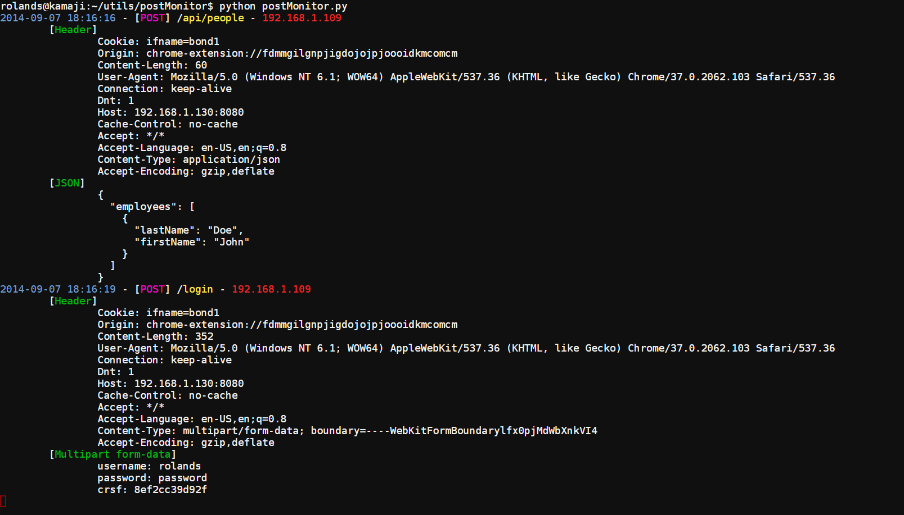

postMonitor
===========

Basic command-line tool to grab all HTTP requests (`GET, POST, PUT, PATCH, DELETE, COPY, HEAD` methods, and a few others) and print them rather nicely (if I don't say so myself.)

Usage
-----

	rolands@kamaji:~/utils/postMonitor./postMonitor.py -h
	usage: postMonitor.py [-h] [-host HOST] [-port PORT] [-headers]

	tool to grab and print all requests to all urls at an address.

	optional arguments:
	  -h, --help  show this help message and exit
	  -host HOST  ip to bind to, default 127.0.0.1
	  -port PORT  port to use, default 8080
	  -headers    show request headers

Todo
----
* Dumping to file / reading dumps
* Shell interface to read dumps / read dump as its happening :o (this might take a while...)

Example
-------
Find & Replace all hosts you request with new host:port and it will grab and print the url and all data passed, **OR** if you are using javascript+jQuery, hook all your calls with [requestHook.js](https://github.com/rolandshoemaker/requestHook.js)

Requirements
------------
* flask
